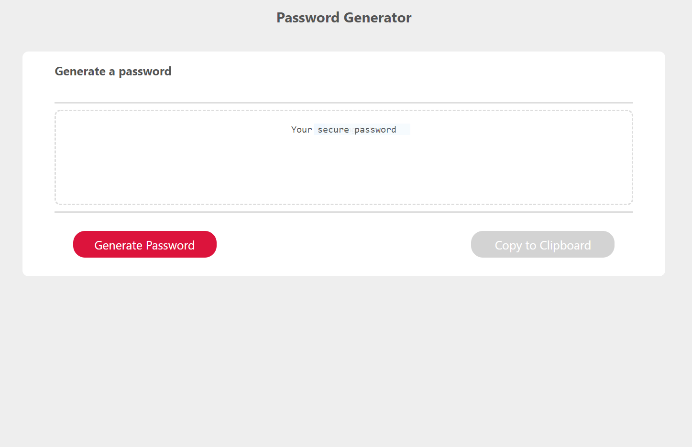

# Password-Generator

A simple application which will generate a password based on the criteria input by the user.

The application window will have two buttons:
* Generate Password
* Copy to Clipboard

"Generate Password" button will ask a user to input password criteria, and then generate a password which would satisfy those criteria.
The user can use the following criteria: 

* Password length (must be 8 - 128 chracters long)
* Special characters
* Numeric characters
* Lowercase characters
* Uppercase characters

"Copy to Clipboard" button will copy the generated password into the clipboard.

Image of the app:

Link to app: 
https://volkir87.github.io/Password-Generator

